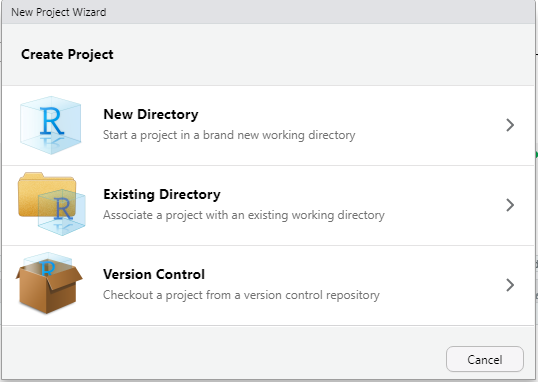

```{r setup, include=FALSE}
knitr::opts_chunk$set(echo = TRUE, warning = FALSE)
```

## Projects and File Management

Projects are an easy way to keep everything in one place. Creating a project will create a folder for you to keep all of your code files (scripts, .Rmd files, etc.), your data (Excel files, csv files, etc.), plots you want to save and anything else related to your project.

You can create projects by clicking the blue icon at the top right of RStudio, choosing "New Project", and then "New Directory". You'll then have the chance to name your project and choose where on your computer to save it.



## Packages

Packages are collections of external software usually designed around a specific theme (visualization, statistics, etc.). Packages can be installed directly from RStudio using the `install.packages()` function. We'll be using a package called `tidyverse` which is actually a collection of packages. Installing `tidyverse` would look like this:


```{r, eval=FALSE}
install.packages("tidyverse")
```


Importantly, you only need to install a package **once** (unless you want to update it). But to use a package you have to load it every time you start a new RStudio session. This is done with the `library()` function.


```{r message=FALSE, warning=FALSE}
library(tidyverse)
```

We'll only be using the `readr` and `ggplot2` packages but it's easier to install all of `tidyverse`.

## Data Import

One common way to import data into R is as csv files. 'csv' stands for comma separated values and is an efficient way of storing data as text separated by commas. If you're working with an excel document you can easily save it as a .csv file. If you already have a lot of excel files that you don't want to convert, there are packages that will read .xls files as is (see <https://readxl.tidyverse.org/>).

The `read_csv()` function from the `readr` package (included in `tidyverse`) is the easiest way to read in .csv files. (Note: `read.csv()` is the Base R equivalent and will work the same, more or less. But if you're using tidyverse functions I'd recommend using `read_csv()`)

The basic format of `read_csv` is to pass it either the file name of your data (saved in the same working directory that RStudio is using), or a url to data stored online, using quotes in both cases. And we assign the data to whatever name we want with `<-`

Here's how this might look on your computer with a file inside your project folder.


```{r, eval=FALSE}

#read csv file and save to name
mydata <- read_csv("my_csv_file.csv")
```

Remember that `read_csv()` comes from the `readr` package which is a part of `tidyverse`. To use it you will have to load either `readr` or `tidyverse` using `library()`. 

## Palmer Penguins

We'll be using the Palmer Penguin data and we can import it directly from a url.


```{r message=FALSE, warning=FALSE}

# load data from online
penguins <- readr::read_csv('https://raw.githubusercontent.com/rfordatascience/tidytuesday/master/data/2020/2020-07-28/penguins.csv')

```


{width="1200"} Artwork by @allison_horst

Let's take a quick look at what the data looks like. We have 8 variables.


```{r}
head(penguins)
```

## ggplot

`ggplot2` is the most popular package for plotting in R. It's built by the same people who make tidyverse and RStudio so it plays well with other tidyverse packages. It's almost infinitely customizeable and there are lots of external add-ons to make interesting and vibrant visualizations.

Here is a template of what the code for a typical ggplot will look like:


```{r, eval =FALSE}

#ggplot template
ggplot(data = <DATA>) +    
  <GEOM_FUNCTION>(mapping = aes(x, y))
```

Think of ggplots as being constructed in layers. You start with a blank canvas and then add new layers on top of each other. (The "gg" in ggplot stands for "grammar of graphics" which is short for the concept of a "layered grammar of graphics".)

Every ggplot will start with with the `ggplot()` function. Every one. Every time. Let's see what `ggplot()` gives us by itself.


```{r}
ggplot()
```

A blank square. This is our blank canvas that I talked about above. We have the space for a plot but haven't told ggplot what to put on it yet. Let's take a look at our template again.


```{r, eval=FALSE}
#ggplot template
ggplot(data = <DATA>) +    
  <GEOM_FUNCTION>(mapping = aes(x, y))
```


After `ggplot()` you add layers that are called "geoms". There's a geom for just about every type of plot you can think of (e.g. `geom_point`, `geom_smooth`, `geom_boxplot`). Geoms tell ggplot what you want to do with the raw data.

Every new layer of a ggplot is separated by a plus sign `+` on the previous line. Be careful not to forget this.

The required arguments for a ggplot are `data` and `mapping` which tell ggplot which dataframe to use and which variables to use, respectively. When you specify a mapping you'll also use another function called `aes()`. The variables you use will always go inside the `aes()` function. I wouldn't worry about the specifics of `aes()` right now. Just remember to always put the variables you're plotting inside it e.g. `aes(x, y)`

### Scatterplots

Do penguins with long flippers also have long bills? We can use `geom_point()` to make a scatterplot. We have two numeric variables that we want to assign to the x- and y-axes and the names of our variables are `bill_length_mm` and `flipper_length_mm`.


```{r}
ggplot(data = penguins)+
  geom_point(mapping = aes(x = bill_length_mm, y = flipper_length_mm))
```

Named arguments are optional in R so you don't have to specify things like `data=` and `mapping=` (just make sure your arguments are in the right place!).


```{r, eval=FALSE}

# this
ggplot(data = penguins)+
  geom_point(mapping = aes(x = bill_length_mm, y = flipper_length_mm))

#same as this
ggplot(penguins)+
  geom_point(aes(bill_length_mm, flipper_length_mm))

```

Naming arguments is partially up to personal preference. As you become more familiar with functions you might choose to not include argument names to save typing and make code more concise. If you think it would be more clear for yourself or someone else reading your code, you can include some arguments. In some of the following examples I will include the `x` and `y` arguments for clarity.


Even better, every geom can take it's own data and arguments OR you can specify them in your first `ggplot()` line. Everything in the `ggplot()` function will be inherited by every line below it. (*Tip*: Don't forget commas between arguments.)


```{r, eval=FALSE}

# this
ggplot(penguins)+
  geom_point(aes(x = bill_length_mm, y = flipper_length_mm))

#same as this
ggplot(penguins, aes(x = bill_length_mm, y = flipper_length_mm))+
  geom_point()

```


What this means is that we can easily add extra geoms that use the same data. What if we want to add a line to our scatter plot? `geom_smooth()` adds a line of best fit with standard error.


```{r}
# adding a line
ggplot(penguins, aes(x = bill_length_mm, y = flipper_length_mm))+
  geom_point()+
  geom_smooth()
```

If you want a linear relationship, you can specify `method = "lm"` (short for "linear model") inside `geom_smooth()`


```{r}
ggplot(penguins, aes(x = bill_length_mm, y = flipper_length_mm))+
  geom_point()+
  geom_smooth(method = "lm")
```


### Adding extra variables

There are features of a ggplot that can be changed to reflect differences between groups such as `colour` and `shape`. These are arguments that can be set **inside** of the `aes()` function and provided with a categorical variable to group by.

For example, what if we wanted to colour points by species. We can set the `colour` argument to be equal to the "species" variable in our data.

```{r}
# colour by species
ggplot(penguins, aes(x = bill_length_mm, y = flipper_length_mm, colour = species))+
  geom_point()+
  geom_smooth(method = "lm")
```

Notice that we also got separate lines for each species. This is because we set colour inside the first `ggplot()` line, so the grouping is inherited by all the layers below it. If we wanted to only colour the points, we can move the colour argument to `geom_point()` (inside of it's own `aes()` function).

```{r}
# colour by species
ggplot(penguins, aes(x = bill_length_mm, y = flipper_length_mm))+
  geom_point(aes(colour = species))+
  geom_smooth(method = "lm")
```

We can do the same thing with the `shape` argument.

```{r}
ggplot(penguins, aes(x = bill_length_mm, y = flipper_length_mm))+
  geom_point(aes(colour = species, shape = species))+
  geom_smooth(method = "lm")
```


#### Displaying a third numeric variable

It can be harder to display three numeric variables in one plot, but one option is to vary point size by the third variable using the `size` argument.

```{r}
ggplot(penguins, aes(bill_length_mm, flipper_length_mm))+
  geom_point(aes(size = body_mass_g))
```

This plot is a bit hard to read. It would be helpful if we could see where points are clustering. We can do this by changing how transparent the points are with the `alpha` argument. Alpha ranges from 0 to 1 with one being solid.

If you want to change an aspect of all of the points (i.e. not based on another variable), you can set that argument *outside* of `aes()`.

```{r}
ggplot(penguins, aes(bill_length_mm, flipper_length_mm))+
  geom_point(aes(size = body_mass_g), alpha = 0.4)
```

## Themes & Styling

### Labels

There are a lot of ways to add labels to your plot but one of the easiest is the `labs()` function that is added on a new line of your ggplot code. Let's use our scatterplot example from earlier.

Inside of `labs()` you can specify labels for your x- and y-axes as well as a title and a subtitle if you'd like. To label your legend, you can add an argument with the same name as the aspect you grouped by (e.g. colour, shape, etc.).
Because we used both colour and shape, we'll have to do some duplication and change the label for both.


```{r}
ggplot(penguins, aes(x = bill_length_mm, y = flipper_length_mm))+
  geom_point(aes(colour = species, shape = species))+
  geom_smooth(method = "lm")+
  labs(title = "Bill & Flipper Lengths of the Palmer Penguin Species",
       x = "Bill Length", y = "Flipper Length", colour = "Species", shape = "Species")
```

### Themes

All of the aspects of a ggplot are customizeable including, grid lines, backgrounds, spacing, and axis ticks. While these can all be changed individually, ggplot comes with some built-in themes to make your plots look cleaner. ggplot themes act as their own function (i.e. on a new line after +) and have the format `theme_*`. It's typical to add a theme function as the last line of your ggplot code. One popular theme is `theme_bw()`


```{r}
ggplot(penguins, aes(x = bill_length_mm, y = flipper_length_mm))+
  geom_point(aes(colour = species, shape = species))+
  geom_smooth(method = "lm")+
  labs(title = "Bill & Flipper Lengths of the Palmer Penguin Species",
       x = "Bill Length", y = "Flipper Length", colour = "Species", shape = "Species")+
  theme_bw()
```

A personal favorite of mine is `theme_classic()`


```{r}
ggplot(penguins, aes(x = bill_length_mm, y = flipper_length_mm))+
  geom_point(aes(colour = species, shape = species))+
  geom_smooth(method = "lm")+
  labs(title = "Bill & Flipper Lengths of the Palmer Penguin Species",
       x = "Bill Length", y = "Flipper Length", colour = "Species", shape = "Species")+
  theme_classic()
```

For examples on how to change smaller aspects of a ggplot, see the documentation on the `theme()` function https://ggplot2.tidyverse.org/reference/theme.html


## Categorical Variables

How many observations are there for each penguin species?

`geom_bar` counts the number of observations in your specified variable. Because the counting is done behind the scenes, you only need to provide one variable (on either the x or y axis; depending on the direction you want your bars to go).

If you already have a dataset of the values you want to plot (e.g. counts or means), `geom_col()` plots raw values.

```{r}
ggplot(penguins, aes(species))+
  geom_bar()

```

### Adding Variables

Adding additional variables works similar to what we've seen before; additional attributes can be specified inside the `aes()` function. Importantly, "colour" will only colour the borders of the bars in a bar plot, to colour inside the bars, you'll want to use "fill" instead.

```{r}
ggplot(penguins, aes(species, fill = island))+
  geom_bar()
```

By default, groups are stacked in bar plots. If you'd like a separate bar for each group you set the `position` argument in `geom_bar` to "dodge".


```{r}
ggplot(penguins, aes(species, fill = island))+
  geom_bar(position = "dodge")
```


## Faceting

We can also create separate plots within plots using ggplot functions like `facet_wrap()` and `facet_grid()`. Inside of `facet_wrap()` you only need to provide the name of the variable you want to facet by after a tilde `~`.

```{r}
ggplot(penguins, aes(x = bill_length_mm, y = flipper_length_mm))+
  geom_point()+
  geom_smooth(method = "lm")+
  facet_wrap(~species)+
  theme_bw()
```


## Summary Statistics

There are several geoms that will calculate summary statistics for you, like `geom_boxplot()`

```{r}
ggplot(penguins, aes(species, body_mass_g))+
  geom_boxplot()
```

There's also a corresponding `geom_violin()` that gives you a better idea of the distribution of your data.

```{r}
ggplot(penguins, aes(species, body_mass_g))+
  geom_violin()
```

### stat_summary()

In all of the geoms we've used so far, there are a lot of functions doing the heavy lifting behind the scenes. In most cases, geoms will cover everything you need. But sometimes we might want more control over how our plot is made. This is where the `stat_*` functions come in, primarily, `stat_summary()`.

Let's say we wanted a bar plot of the mean body mass for penguins of each species. There's no geom that calculates a mean and displays bars. `geom_bar()` only calculates counts by default. Luckily, `stat_summary()` calculates mean and standard error by default.

```{r}
ggplot(penguins, aes(species, body_mass_g))+
  stat_summary()
```

Oops, that's not a bar plot. There's one more thing we have to change to get our bar plot. `stat_summary()` has a `geom` argument that by default is set to "pointrange" which is what we're seeing above. The geom we want is "bar" so we'll add an argument inside `stat_summary()`. We can also add error bars with another `stat_summary()` layer.

```{r}
ggplot(penguins, aes(species, body_mass_g))+
  stat_summary(geom = "bar")+
  stat_summary(geom = "errorbar")
```


This plot isn't that informative about our data. Let's see if we can do a little better. We can add some transparent points to show how our data are distributed. And we'll add some transparency to our bars so we can see the points, and add a border around them by setting the `size` argument. Also, we'll add some colour using `fill` just for aesthetics.

```{r}
ggplot(penguins, aes(species, body_mass_g))+
  stat_summary(fun = "mean",
               geom = "bar",
               alpha = 0.5,
               color = "black",
               size = 0.5,
               mapping = aes(fill=species))+
  geom_point(alpha = 0.3)

```


This a bit better but still not as clear as it could be. We still can't see the distribution of the individual data points that well. We can use a useful function called `geom_jitter()` to fix this. `geom_jitter()` adds a small amount of random noise to points so you can more easily see where points are clustering. We set how much it "jitters" the data using the `height` and `width` arguments. `geom_jitter()` is also useful for crowded scatter plots.

```{r}
ggplot(penguins, aes(species, body_mass_g))+
  stat_summary(fun = "mean",
               geom = "bar",
               alpha = 0.5,
               color = "black",
               size = 0.5,
               mapping = aes(fill=species))+
  geom_jitter(width = 0.1, height = 0.1, alpha = 0.3)
```

This is better but because our data have relative high means with little variation, we have all this extra space in the bars. One option would be to zoom in on you plot using something like `coord_cartesian()` which lets you set the limits of your axes. In this case, we're changing the `ylim` argument.


```{r}
ggplot(penguins, aes(species, body_mass_g))+
  stat_summary(fun = "mean",
               geom = "bar",
               alpha = 0.5,
               color = "black",
               size = 0.5,
               mapping = aes(fill=species))+
  geom_jitter(width = 0.1, height = 0.1, alpha = 0.3)+
  coord_cartesian(ylim = c(2500, 6400))+
  theme_bw()+
  guides(fill = FALSE)+ #get rid of legend
  labs(x = NULL, y = "Body Mass (g)")

```


This definitely looks better but maybe we could do more to represent the distribution in this data. `geom_violin()` can help with this. We'll add in some mean lines with `stat_summary()` and geom "crossbar".

```{r}
ggplot(penguins, aes(species, body_mass_g))+
  geom_violin(alpha = 0.1, mapping = aes(fill = species), show.legend = F)+
  geom_jitter(width = 0.05, height = 0.05, alpha = 0.3)+
  stat_summary(fun = "mean", geom = "crossbar", width = 0.3)+ # mean lines
  theme_bw()+
  labs(x = NULL, y = "Body Mass (g)")
  
```

#### Bonus

One of the benefits of ggplot is it's infinite customizeability. There are a ton of add-ons that let you make more complex and more effective lots. Here's a small-scale example using a function called `geom_flat_violin()` by Ben Marwick. I source the function directly from a link where the code is hosted online but it can also be found in the `PupillometryR` package.

```{r}
source("https://gist.githubusercontent.com/benmarwick/2a1bb0133ff568cbe28d/raw/fb53bd97121f7f9ce947837ef1a4c65a73bffb3f/geom_flat_violin.R")

ggplot(penguins, aes(species, body_mass_g, fill=species))+
  geom_boxplot(width = 0.2, outlier.shape = NA, alpha = 0.8)+
  geom_flat_violin(position = position_nudge(x = 0.2, y = 0), alpha = 0.8)+
  geom_jitter(width = 0.1, alpha = 0.5, size = 1)+
  guides(fill = FALSE, color = FALSE)+ # get rid of legend
  theme_classic()+
  labs(x = NULL, y = "Body Mass (g)\n")
```

### Plotly

Plotly is a software that works across many platforms and languages and is used to make interactive visualizations. In R there's a package called `plotly`. Mouse over the points in the plot below to see how it works!

```{r}
ex <- ggplot(penguins, aes(x = bill_length_mm, y = flipper_length_mm))+
  geom_point(aes(colour = species))+
  geom_smooth(method = "lm")+
  theme_bw()

plotly::ggplotly(ex)
```

There are lots of similar add-ons for ggplot. Try `gganimate` for animated plots, or the `patchwork` package for combining multiple ggplots into one figure.

### Resources

**From Data to Viz**:
https://www.data-to-viz.com/

**R for Data Science**:
https://r4ds.had.co.nz/

**ggplot Textbook**:
https://ggplot2-book.org/

Data Sourced from:
https://allisonhorst.github.io/palmerpenguins/


